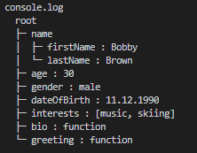
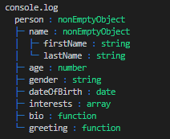

# treeifier

- A Typescript/JavaScript library generating a tree representation of any object.
  - Treeifier is able to process any kind of input javascript object (structured or not).
  - Treeifier evaluates the types of the contained values (empty, string, number, date, function, symbol, array, array of objects, non empty objects) and adapt the output/representation accordingly.
  - A *client application* may adapt the representation as needed in its own representation *processor*, using the analysis performed i.e the information ascertained by Treeifier. e.g. to generate a DOM elements structure (objectual representation) or an alternative output string format (textual representation).
  - Treeifier can be integrated in multiple kind of applications: the library can be used as a TS (typescript), CJS (nodejs) or ESM (browser) module.

- A CLI parsing folders, JSON files ... to generate a tree-view of the content. (*not released yet*)

**treeifier** makes your "valuables" visible!

## introduction

> What's the structure of the instance, array, variable ...? What's its content, what's inside?

This are questions **treeifier** aims to answer in a very pramgmatic way i.e. in form of a **tree representation** of the actually observed "valuable" (the *intransparent* object of your attention).

> How to...? Is treeifier eaysy to use?

Indeed!

```javascript
import { Treeifier } from "treeifier";

// output as ascii tree using default processor
console.log( new Treeifier().process( myObject ) );

// or

// output as ascii tree using default processor
const treeifier = new Treeifier();
const tree: string = treeifier.process( myObject );
console.log( tree );
```

That's it!

## screenshots (output examples)

Using the `defaultProcessor` (no need to specify it explicitly) and the `defaultColoredValuesProcessor` &amp; `defaultColoredTypesProcessor` provided in the `treeifier-utils` module, you'd get:

|default ASCII tree (string)|*values* colored ASCII tree (string)|*types* colored ASCII tree (string)
|:---:|:---:|:---:|
|  |  |  |
|`myTreeifier.process( aPerson )`|`myTreeifier.process( aPerson, 'person', TreeifierUtils.defaultColoredValuesProcessor )`| `myTreeifier.process( aPerson, 'person', TreeifierUtils.defaultColoredTypesProcessor )`|

Note:

- colors can be redefined/overriden as needed (colors for 'tree structure', 'key', 'value' and 'circular ref.')
- not all available output formats are demonstrated here.

## use cases

### software development

Among others:

- **transformation**: transform an input object into an alternative representation like XML, HTML etc.
- **debugging and logging**: display the current state of an object in console, stream, file...
- **documentation**: visuallize the structure of an object, including the type of its properties
- **data simplification**: deep copy the "values" from a complex class instance into a (simple) data object e.g. a DTO
- **user friendly visualization**: visualize the content of folders or "structured data" as a tree...

Note: the *transformation* use case could aim at displaying data on the UI directly i.e. per DOM element creation.

### CLI

A CLI application is **planned**:

- display "folders and files"  structures as tree
- display JSON file content as tree (e.g. package.json ...)
- ... web API query responses, DB queries...

## usage

Below are example demonstrating some of the use cases as defined above:

### display a tree representation of an object instance in the console

```javascript
import { Treeifier } from "treeifier";
import { TreeifierUtils } from 'treeifier-utils';

console.log( new Treeifier().process( myObjectInstance, '', TreeifierUtils.defaultColoredProcessor) );
```

see second screenshot above.

### generate a textual (i.e. string) HTML list representation

```javascript
import { Treeifier } from "treeifier";
import { TreeifierUtils } from 'treeifier-utils';

const treeifier = new Treeifier();
const htmlList: string = treeifier.process( myObjectInstance, '', TreeifierUtils.defaultHTMLProcessor) ;

// do proceed with the html list as string e.g. output to console etc.

```

### debug/analyze the result of processing an object (&rightarrow; console)

This can be useful to debug your own processor function:

```javascript
import { Treeifier } from "treeifier";
import { TreeifierUtils } from 'treeifier-utils';
import { TreeifierNode } from 'treeifier-node';
import chalk from 'chalk';

const treeifier = new Treeifier();
// 0. OPTIONAL: adapt the color of displayed circular references (if any)
TreeifierUtils.CircularColor = chalk.magenta;
// 1. process the input object using own processor function and a label for the tree root
const processResultRootNode: TreeifierNode = treeifier.parse( myObjectInstance, 'myObjectInstance', myProcessorFunction) ;
// 2. output the ASCII tree representation of the node structure generated by treeifier. In other words "treeify the treeified".
const debugResult: string = TreeifierUtils.debugResultNode( processResultRootNode, treeifier );
// 3. display in the console
console.log(debugResult);
```

Further information on debugging can be found in the "debugging" chapter below.

### treeify an object instance using own processor

```javascript
import { Treeifier } from "treeifier";

function myProcessor ( node: TreeifierNode ): any => {
  ...
  // generate the representation of the current node
  ...
  return representation_of_the_current_node;
}

const treeifier = new Treeifier();
console.log( treeifier.process( myObjectInstance, '', myProcessor) );

```

To learn how to write your own processor function, see the documentation on [Writing a "processor" function][write-processor].

## principles

### INPUT

your object instance / your variable. It can be in an unknow shape.

e.g. (simplified for demonstration purpose. Usually, a class definition and an instance of this class would have been used)

```javascript
const person = {
  name: {
    firstName: 'Bobby',
    lastName: 'Brown'
  },
  age: 30, 
  dateOfBirth: new Date( 1990, 11, 11 ), // => 11.12.1990
  interests: ['music', 'skiing'],
  greeting: function (): string {
    return 'Hi! I\'m ' + this.name.firstName + '.';
  }
};
```

### PROCESSOR

a single function used to **shape the tree** i.e. shape the branches and leafs exposed by the process result:

- **defaults**: use one of the default processors as provided in the `treeifier-utils` module
- **BYOP**: bring your own processor function
  - **sort-as-you-need**: organize the output as required (some example "sort" functions are included)
  - **filter-as-you-need**: select the branches and leafs you'd like to output
  - **shape-as-you-want**: generate the "processResult" as needed i.e. as a specifically formated string or object.

Note the resulting **tree** may be a simple list i.e. it doesn't need to be structured at all, depending on your implementation goals.

See the documentation on [Writing a "processor" function][write-processor]

### OUTPUT

a textual or objectual representation of the treeified input, according to the utilized processor.

- textual: as ascii-ed tree, as html or xml source code, as CSV, as ...
- objectual: as object structure mapping the input structure i.e. DOM elements, HTML or XML node structure etc.

#### textual output

example of ascii-ed tree representation using the "defaultProcessor" provided in the treeifier utils as per `new Treeifier().process( person, 'person', TreeifierUtils.defaultProcessor )`:

```ascii
  person
  ├─ name
  │  ├─ firstName : Bobby
  │  └─ lastName : Brown
  ├─ age : 30
  ├─ gender : male
  ├─ dateOfBirth : 11.12.1990
  ├─ interests : [music, skiing]
  └─ greeting : function
```

#### objectual output

The processor may return "objects" instead of "strings" back to the Treeifier.process function. The result of the processing will then be the "root" object as generated by the processor, hence the processor should account to provide a root object.

e.g. `const XMLStructureRootObject = new Treeifier().process( person, 'person', My_XML_Object_Structure_Processor )`.

See the documentation on [Writing a "processor" function][write-processor]

## debugging

You may want to:

- debug the analyzed *input object* (e.g. to check the details, properties, values etc. of the object as analysed/recognized by treeifier) or
- debug the result of your own treeifier *processor function* (stored in the "processResult" property of each TreeifierNode).

For such purposes, use the `debug` function provided in the `treeifier-utils` module:

### calling the debug function

```javascript
// debug the input object
import { TreeifierUtils } from 'treeifier-utils';

const debugResult = TreeifierUtils.debug( item );
console.log( debugResult );
```

or

```javascript
// debug the object and the very special processor...
import { Treeifier } from "treeifier";
import { TreeifierUtils } from 'treeifier-utils';
import { TreeifierNode } from 'treeifier-node';

function myVerySpecialProcessor ( node: TreeifierNode ): any => {
  ...
  // generate the representation of the current node
  ...
  return representation_of_the_current_node;
}

const debugResult = TreeifierUtils.debug( item, '', myVerySpecialProcessor );
console.log( debugResult );

```

### debug output example

Shortened example of the `TreeifierNode` structure as exposed by the **debug** function:

```ascii
treeifier_root_node_person
├─ key person
├─ value
│  ├─ name
│  │  ├─ firstName Bobby
│  │  └─ lastName Brown
│  ├─ age 30
│  ├─ gender male
│  ├─ dateOfBirth 11.12.1990
│  ├─ interests [music, skiing]
│  ├─ bio function
│  └─ greeting function
├─ index 0
├─ parent null
├─ nodeType nonEmptyObject
├─ ancestors [person]
├─ circularRefIndex -1
├─ isCircular false
├─ circularRefNode null
├─ isLeaf false
├─ isBranch true
├─ isValue false
├─ depth 0
├─ maxIndex 0
├─ prefix
├─ joint
├─ children
│  ├─ 0
│  │  ├─ key name
│  │  ├─ value
│  │  │  ├─ firstName Bobby
│  │  │  └─ lastName Brown
...
```

note: the standard output of the `debug` function is colored by default, though this is not visible in the example above.


[write-processor]: ./docs/writing-a-processor-function.md
