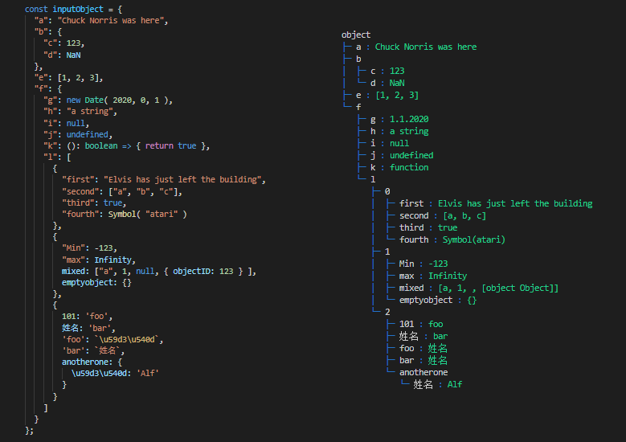
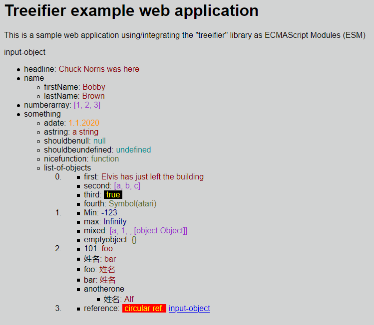

<!-- markdownlint-disable MD033 MD005 -->
# treeifier

A (dependency-free!) Typescript/JavaScript library generating a **structured (tree) representation** (textual or objectual) of any object. **treeifier** should make your "valuables" visible!

treeifier is published as [npm package](https://www.npmjs.com/package/@khatastroffik/treeifier) under MIT license.

treeifier-utils is published as [npm package](https://www.npmjs.com/package/@khatastroffik/treeifier-utils) under MIT license.

## screenshots

Examples of object representation/output as generated using the integrated `defaultProcessor` (no need to specify it explicitly) and the `defaultColoredValuesProcessor` provided in the [treeifier-utils][treeifier-utils] library:

| default output |input object &rightarrow; output representation|
|:---:|:---:|
|  |  |
|`myTreeifier.process( aPerson )`|`myTreeifier.process( inputObject, 'object', TreeifierUtils.defaultColoredValuesProcessor )`|

Note:

- See the additional library package [treeifier-utils][treeifier-utils] for more *predefined representation/output formats*.
- The colors can be adjusted using the [chalk](https://github.com/chalk/chalk) library.

## introduction

Treeifier is able to process any kind of javascript input e.g. objects (structured or not), arrays etc.

- Treeifier **evaluates the types** of the contained property values (empty, string, number, date, function, symbol, array, array of objects, non empty objects) and adapt the output/representation accordingly.
- A *client application* may **adapt the representation as needed** in its own representation *processor*, using the analysis performed i.e the information ascertained by Treeifier. e.g. to generate a DOM elements structure (objectual representation) or an alternative output string format (textual representation).
- Treeifier can be integrated in multiple kind of applications: it is available as a TS (typescript), CJS (nodejs) or ESM (browser) module.

> What's the structure of my object instance, array, variable ...? What's its content, what's inside?

This are questions **treeifier** aims to answer in a very pragmatic way i.e. in form of a **tree representation** of the actually observed "valuable" (the *intransparent* object of your attention).

> How to...? Is treeifier eaysy to use?

Indeed!

## installation and first-step

Install the treeifier library in your (typescript/javascript) project as a **development dependency** (example below) or **standard dependency** (replace *--save-dev* with *--save* ) depending on your project's requirements:

```shell
> npm install --save-dev @khatastroffik/treeifier
```

and then use it as in

```javascript
import { Treeifier } from "treeifier";

// output as ascii tree using default processor
console.log( new Treeifier().process( myObject ) );
```

or

```javascript
// output as ascii tree using default processor
const treeifier = new Treeifier();
const objectRepresentation: string = treeifier.process( myObject );
console.log( objectRepresentation );
```

That's it!

## use cases

Among others:

- **transformation**: transform an input object into an alternative representation like a string list, XML, HTML etc. strings or object structures
- **debugging and logging**: display the current state of an object in console, stream, file...
- **documentation**: visuallize the structure of an object, including the type of its properties
- **data simplification**: deep copy the "values" from a complex class instance into a (simple) data object e.g. a DTO
- **user friendly visualization**: visualize the content of folders or "structured data" as a tree.

Note: the *transformation* use case could aim at displaying data on the UI directly i.e. per DOM element creation. See the sample browser application.

## usage

Below are some examples demonstrating some of the use cases as defined above:

### display a tree representation of an object in the console

This example makes use of the standard processor (integrated in the Treeifier instance).

```javascript
import { Treeifier } from "treeifier";

console.log( new Treeifier().process( myObjectInstance ) );
```

### treeify an object using your own processor

This example makes use of of a processor as provided by the client application.

```javascript
import { Treeifier } from "treeifier";

function myProcessor ( node: TreeifierNode ): any => {
  ...
  // generate the representation of the current node
  ...
  return representation_of_the_current_node;
}

const treeifier = new Treeifier();
console.log( treeifier.process( myObjectInstance, '', myProcessor) );

```

To learn how to write your own processor function, see the documentation on [Writing a "processor" function][write-processor].

## treeifier principles

### INPUT

your object instance / your variable. It can be of **any (unknown) shape**.

e.g. (simplified)

```javascript
const person = {
  name: {
    firstName: 'Bobby',
    lastName: 'Brown'
  },
  age: 30,
  dateOfBirth: new Date( 1990, 11, 11 ), // => 11.12.1990
  interests: ['music', 'skiing'],
  greeting: function (): string {
    return 'Hi! I\'m ' + this.name.firstName + '.';
  }
};
```

### PROCESSOR

a single function used to **shape the representation** of the input object i.e. shape the branches and leafs exposed as *process result*:

- **defaults**: use one of the default processors as provided in the [treeifier-utils][treeifier-utils] module
- **BYOP**: bring your own processor function
  - **sort-as-you-need**: organize the output as required (some example "sort" functions are included)
  - **filter-as-you-need**: select the branches and leafs you'd like to output
  - **shape-as-you-want**: generate the "processResult" as needed i.e. as a specifically formated string or object.

Note the resulting **tree** may be a simple list i.e. it doesn't need to be structured at all, depending on your implementation goals.

See the documentation on [Writing a "processor" function][write-processor]

### OUTPUT

a textual or objectual representation of the treeified input, according to the utilized processor.

- textual: as ascii-ed tree, as html or xml source code, as CSV, as ...
- objectual: as object structure mapping the input structure i.e. DOM elements, HTML or XML node structure etc.

#### textual output

example of ascii-ed tree representation using the default processor provided by Treeifier as per `new Treeifier().process( person, 'person' )`:

```ascii
  person
  ├─ name
  │  ├─ firstName : Bobby
  │  └─ lastName : Brown
  ├─ age : 30
  ├─ gender : male
  ├─ dateOfBirth : 11.12.1990
  ├─ interests : [music, skiing]
  └─ greeting : function
```

#### objectual output

The processor may return "objects" instead of "strings" back up to the Treeifier.process function result. The result of the processing will then be the "root" as generated by the processor, hence the processor should account to generate/provide a root object.

e.g. `const DOM_RootObject = new Treeifier().process( person, 'person', My_DOM_Elements_Processor )`.



See the documentation on [Writing a "processor" function][write-processor]

## API

Please see the [API documentation][API-documentation].

## debugging

Please see the [debugging documentation][debugging].

[write-processor]: ./doc/writing-a-processor-function.md
[treeifier-utils]: https://github.com/khatastroffik/treeifier-utils
[API-documentation]: ./doc/api.md
[debugging]: ./doc/debugging.md
